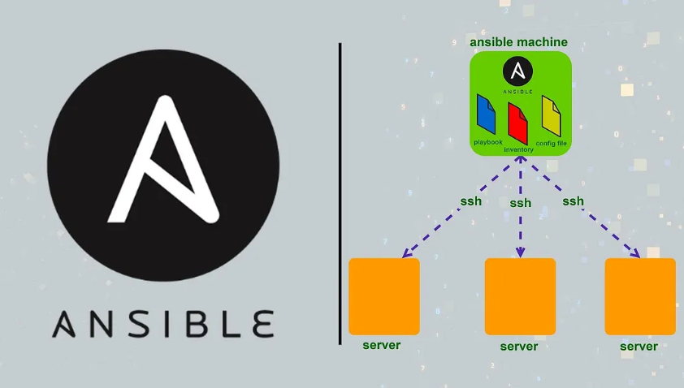

# RHCE: RedHat Certified Engineer - Session 1: Introduction & Setup


## Objective
By the end of this session, you will be able to:

1. Understand what Ansible is and its key features
2. Distinguish between control nodes and managed nodes
3. Set up Ansible on RHEL/CentOS
4. Execute basic Ansible commands
5. Explore and manage the inventory

---

## What is Ansible?

**Definition:**  
Ansible is an open-source IT automation tool that helps automate:

- Configuration management  
- Application deployment  
- Task automation  
- Orchestration of multi-tier IT environments

### Key Features

| Feature | Description |
|---------|-------------|
| **Agentless** | No agent installation required on managed nodes; uses SSH |
| **Simple YAML** | Playbooks written in human-readable YAML syntax |
| **Idempotent** | Running the same task multiple times produces the same result |
| **Extensible** | Supports modules for various services and systems |

---

## Agentless Architecture & YAML Syntax

### Architecture Diagram



*Figure 2: Control Node communicating with Managed Nodes via SSH*

### Architecture Components

| Component      | Description |
|----------------|-------------|
| **Control Node** | The machine where Ansible is installed. Executes tasks and playbooks |
| **Managed Node** | Machines that Ansible manages via SSH. No agent required |

### YAML Basics

- YAML stands for YAML Ain't Markup Language
- Case sensitive - pay attention to capitalization
- Indentation matters - use spaces, not tabs
- Human-readable and easy to learn

**Example YAML Playbook:**

Note: Do not worry if you do not understand the YAML file structure now. We will discuss it in the upcoming sessions.

```yaml
---
- hosts: all
  tasks:
    - name: Ensure a directory exists
      file:
        path: /tmp/demo
        state: directory
        mode: '0755'
```

---

## Control Node vs Managed Nodes

### Comparison Table

| Node Type | Role | Requirements |
|-----------|------|--------------|
| **Control Node** | Executes playbooks, communicates with managed nodes | Ansible installed, Python |
| **Managed Node** | Receives commands via SSH and performs tasks | SSH access, Python |

### Setting Up Ansible User on Managed Nodes

**Important:** Perform these steps on each managed node.

```bash
# 1. Create ansible user
sudo useradd ansible

# 2. Set password for ansible user
sudo passwd ansible

# 3. Add ansible user to sudoers for privilege escalation
echo "ansible ALL=(ALL) NOPASSWD: ALL" | sudo tee /etc/sudoers.d/ansible

# 4. Verify sudoers configuration
sudo visudo -c

# 5. Switch to ansible user
su - ansible
```

### SSH Key Setup for Passwordless Authentication

**On the Control Node as ansible user:**

```bash

# 1. Update system packages
sudo dnf update -y

# 3. Install Ansible
sudo dnf install ansible -y

# 4. Verify installation
ansible --version

# 5. Generate SSH key pair
# Press Enter for all prompts to accept defaults
ssh-keygen -t rsa -b 2048

# 6. Copy public key to managed nodes
ssh-copy-id ansible@managed-node-ip

# Example:
ssh-copy-id ansible@192.168.1.11

# 3. Test SSH connection
# This should not ask for password
ssh ansible@managed-node-ip

# 4. Exit from the managed node
exit
```


*Figure 3: SSH key-based authentication setup*

---

## Inventory and Configuration Files

### Why Do We Need Inventory and Configuration Files?

**Inventory File:**
The inventory file tells Ansible which servers to manage. Without an inventory file, Ansible does not know which machines to connect to or what tasks to run on them. Think of it as a contact list for your servers.

**ansible.cfg File:**
The ansible.cfg file contains configuration settings for Ansible. It defines how Ansible behaves, such as which user to connect as, where to find the inventory file, and how to handle privileges. This helps you customize Ansible for your specific needs.

**Default Location vs Best Practice:**

By default, Ansible looks for these files in `/etc/ansible/`:
- `/etc/ansible/hosts` - Default inventory file
- `/etc/ansible/ansible.cfg` - Default configuration file

However, the **best practice** is to create separate inventory and configuration files for each project. This approach offers several benefits:

1. **Project isolation** - Each project has its own settings
2. **Version control** - You can track changes in Git
3. **Portability** - Easy to move projects between systems
4. **No conflicts** - Different projects can have different configurations
5. **Security** - Avoid storing sensitive information in system-wide files

**Recommended structure:**
```
my-ansible-project/
├── ansible.cfg
├── inventory
└── playbook.yaml
```

### INI Format Example: (inventory file)
(by defining the host in the /etc/hosts file example: 192.186.1.2   web1.example.com)

```
[webservers]
web1.example.com
web2.example.com

[dbservers]
db1.example.com
db2.example.com

[webapp:children]
webservers
dbservers
```

or (ip adresses)

```
[webservers]
192.168.1.2
192.168.1.3

[dbservers]
192.168.1.4

[webapp:children]
webservers
dbservers
```


*Figure 4: Inventory hierarchy and grouping*

### ansible.cfg Format Example

```ini
[defaults]
inventory = ./inventory
remote_user = ansible
[privilege_escalation]
become = True
become_method = sudo
become_user = root
```

**Explanation of Common Settings:**

| Setting | Description |
|---------|-------------|
| `inventory` | Location of your inventory file |
| `remote_user` | Default user for SSH connections |
| `become` | Enable privilege escalation (sudo) |
| `become_method` | Method for privilege escalation (sudo, su, etc.) |
| `become_user` | User to become (usually root) |

**Ad-hoc Commands – Objective:**  
Validate that the **Ansible inventory** and **ansible.cfg** are correctly configured and that the control node can communicate with all managed nodes.

**Tasks:**

1. Verify connectivity to all managed nodes:
```bash
ansible all -m ping
```
